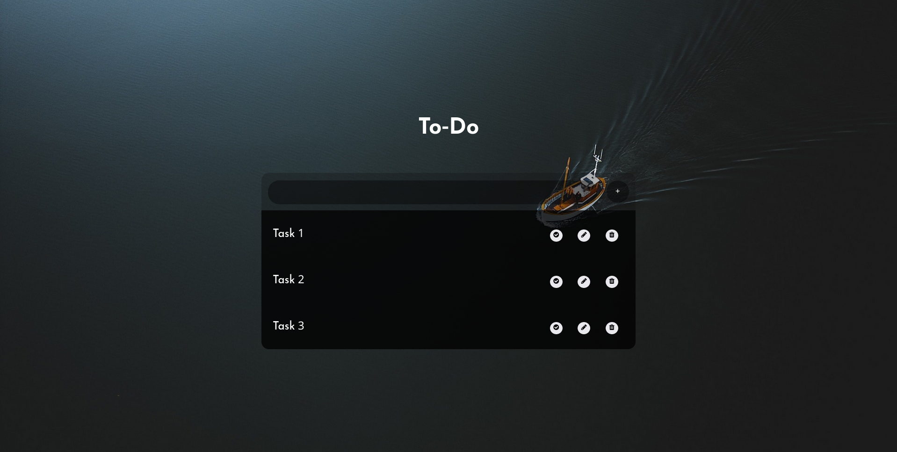

# ToDo
This is a To-Do List Application With Local Storage
## Usage
- this app can be used on web browsers 
1. just clone the repo and open the index.html.
2. save the page on your bookmark.
3. start doing your list.
## Or Just Use This link
- https://killingfiction.github.io/ToDo/
## Features
- It is a local storage app
The edit you commit will be saved in your browser and not be deleted after closing the browser.
